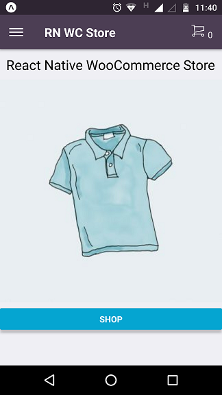
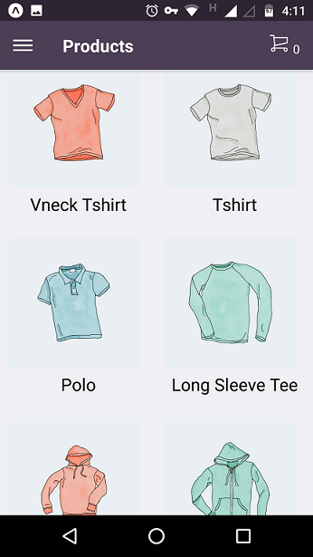
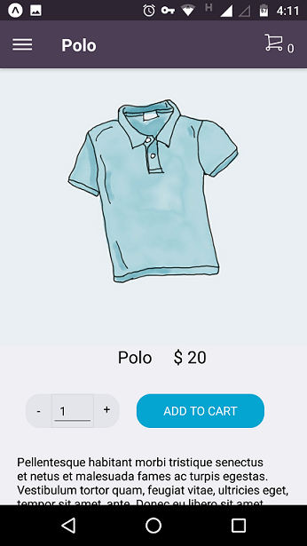

# React Native Woocommerce Store
A React Native mobile app using and WordPress and WooCommerce at the back end. Works on iOS and Android.






This project was bootstrapped with [Create React Native App](https://github.com/react-community/create-react-native-app).

## How to run

```
git clone https://github.com/laccadive-io/react-native-woocommerce-store.git
cd react-native-woocommerce-store
npm install
npm start
```

Open up Expo app in your iOS or Android phone. Scan the QR code appearing on the console or type in the given URL.

You can continue to edit and changes will be loaded onto your phone in real-time.

Happy coding!